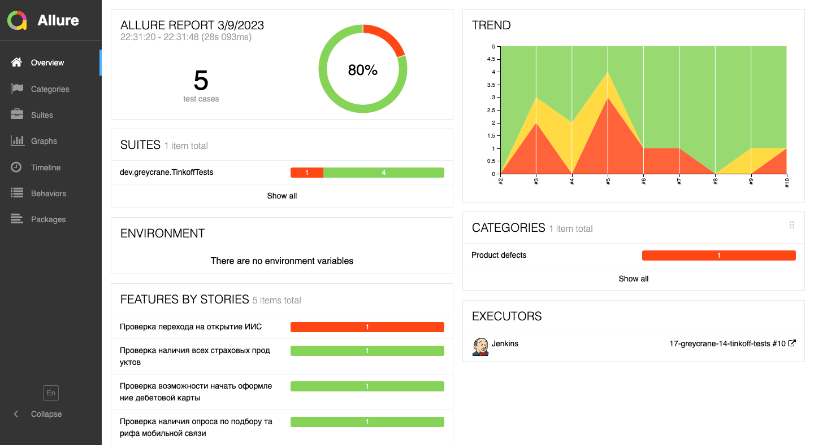

| <h1>Автоматизация тестирования UI веб-сайта <a href="https://tinkoff.ru/ ">Тинькофф</a></h1> |  |
| ----------------------------------------------------------------------------------------------- | ---------------------------------------- |

## Содержание

* <a href="#description">Описание</a>

* <a href="#scenarios">Тестовые сценарии</a>

* <a href="#tools">Технологии и инструменты</a>

* <a href="#run">Как запустить тесты</a>

* <a href="#screenshots">Скриншоты и видео</a>

## Описание

Это тестовый проект по автоматизации тестирования пользовательского интерфейса
веб-сайта <a href="https://tinkoff.ru/ ">Тинькофф</a>. 
Он создан для демонстрации моих навыков и способностей построения тестового фреймворка с нуля для дальнейшего
устройства в компанию **Tinkoff**.

В проекте используется самый современный стэк технологий, присутствует интеграция с системами CI/CD и issue-трекерами,
генерируются удобные и понятные отчёты о запуске тестов. 

## Тестовые сценарии

| №    | 
Название
                                       | Важность                 |
| ---- | ----------------------------------------------------------------------------- | ------------------------ |
| 1    | :sparkle: Проверка возможности начать оформление дебетовой карты              | :red_square: BLOCKER     |
| 2    | :sparkle: Проверка наличия опроса по подбору тарифа мобильной связи           | :orange_square: CRITICAL |
| 3    | :sparkle: Проверка перехода на открытие ИИС                                   | :red_square: BLOCKER     |
| 4    | :sparkle: Проверка наличия всех страховых продуктов                           | :orange_square: CRITICAL |
| 5    | :sparkle: Проверка наличия ошибки при неверном номере телефона при входе в ЛК | :yellow_square: NORMAL   |

## Технологии и инструменты

:eight_spoked_asterisk: Java - язык программирования для написания тестов.
:eight_spoked_asterisk: JUnit5 - фреймворк для запуска автотестов.
:eight_spoked_asterisk: Allure Report - средство визуализации отчётов о тестировании.
:eight_spoked_asterisk: Allure TestOps - система тест менеджмента.
:eight_spoked_asterisk: Gradle - средство автоматизации сборок.
:eight_spoked_asterisk: Jenkins - система CI/CD (Continuous Integration / Continuous Delivery).
:eight_spoked_asterisk: Selenoid - сервер для удалённого запуска автотестов в Docker-контейнерах.
:eight_spoked_asterisk: Selenide - фреймворк для написания автотестов.
:eight_spoked_asterisk: IntelliJ IDEA - среда разработки программного кода.
:eight_spoked_asterisk: GitHub - система удалённого хранения исходного кода.
:eight_spoked_asterisk: Jira - система управления задачами и проектами.
:eight_spoked_asterisk: Telegram Bot - бот для оповещения о результатах тестирования.

## Как запустить тесты

### Gradle

В командной строке среды разработки IntelliJ IDEA необходимо выполнить следующую команду:

`gradle clean tinkoff_tests`

Также можно запустить тесты с дополнительными параметрами:

**selenoid** - адрес сервера Selenoid
 **browser** - название браузера
 **version** - версия браузера
 **resolution** - разрешение окна браузера

Пример запуска автотестов с дополнительными параметрами:

`gradle clean tinkoff_tests -Dselenoid=https://seleno.id -Dbrowser=chrome -Dversion=100.0 -Dresolution=1920x1080`

### Jenkins

Необходимо перейти <a href="https://jenkins.autotests.cloud/job/17-greycrane-14-tinkoff-tests/">по ссылке</a> и нажать "Собрать с параметрами". 
Далее выберите необходимые параметры для запуска автотестов и нажмите на кнопку "Собрать".

## Скриншоты и видео

После запуска автотестов генерируется простой и понятный отчёт в Allure.

